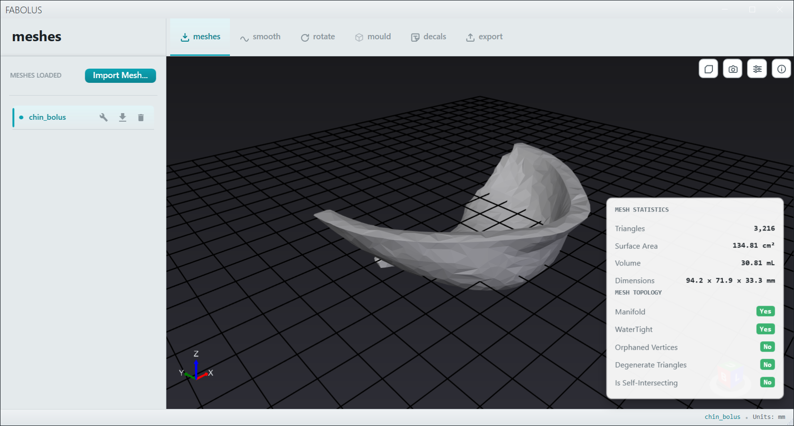
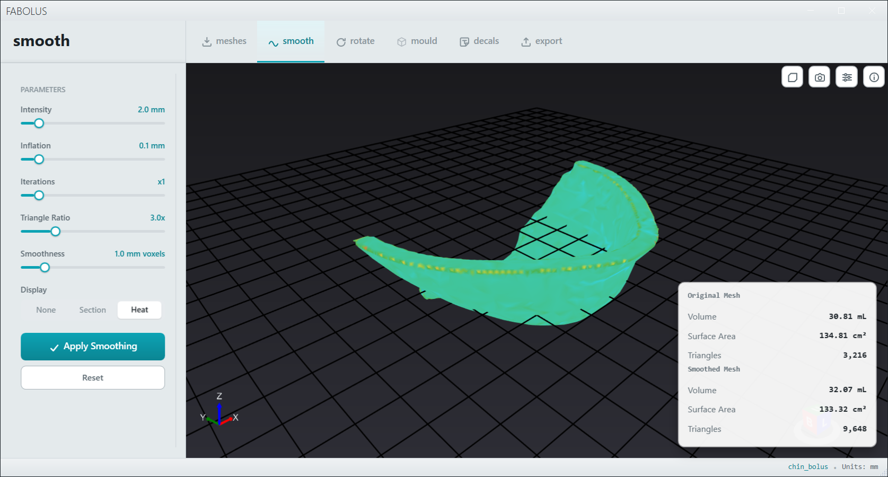
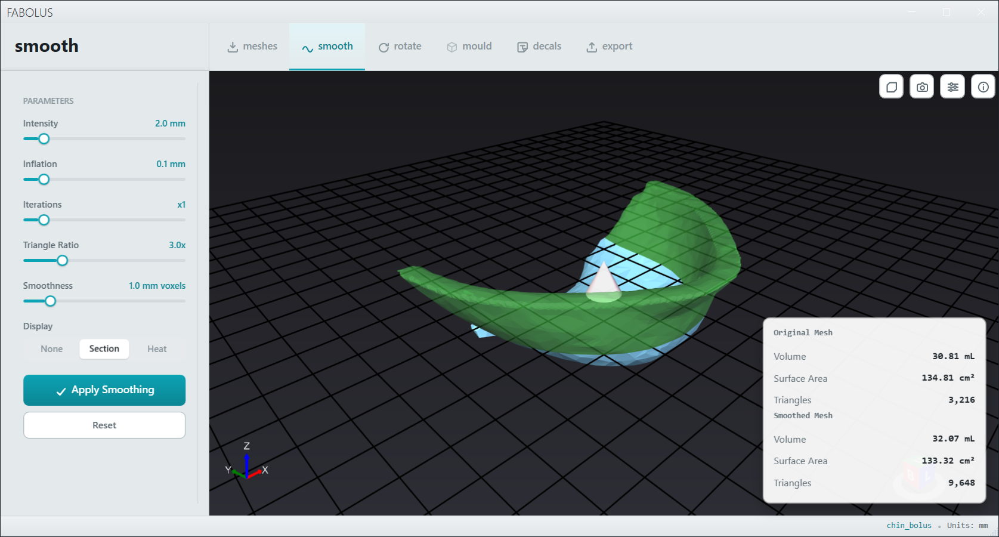
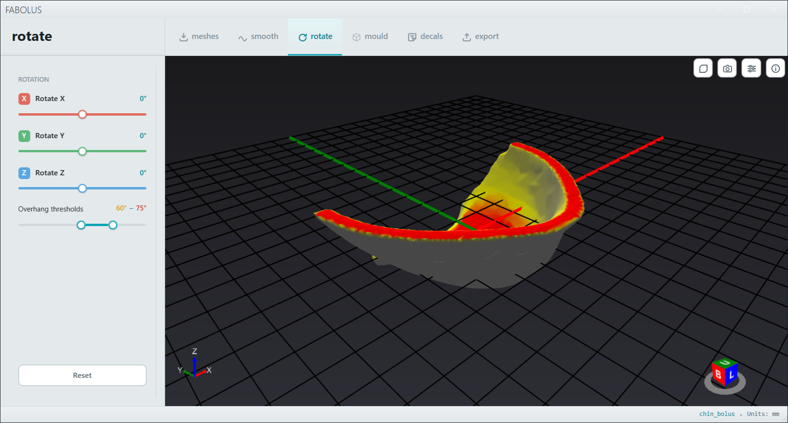
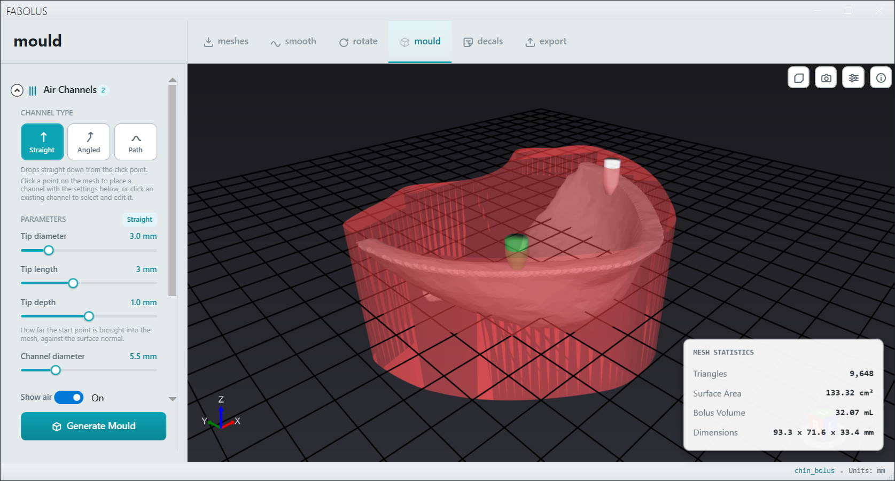
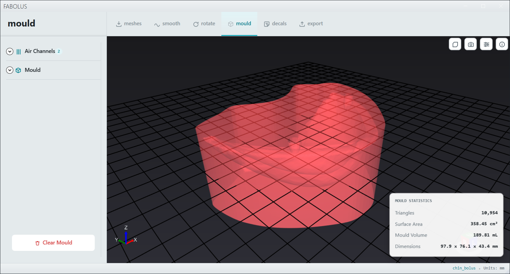
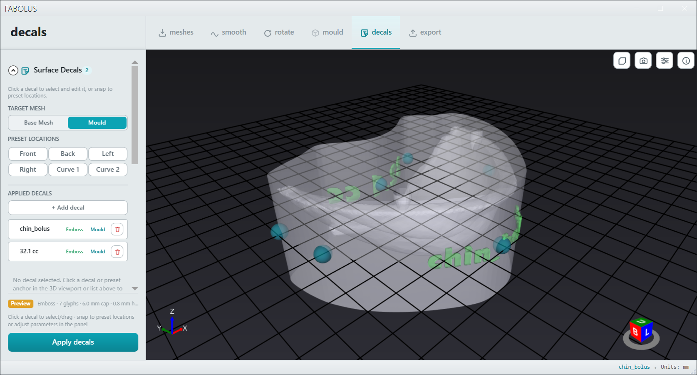
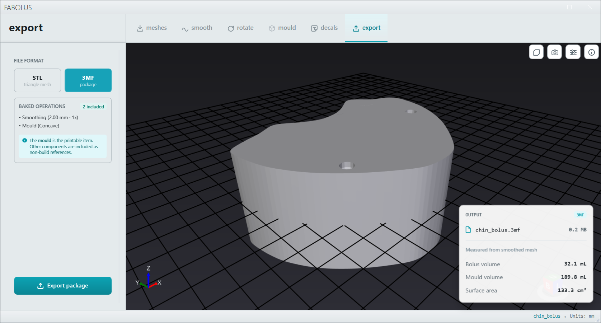
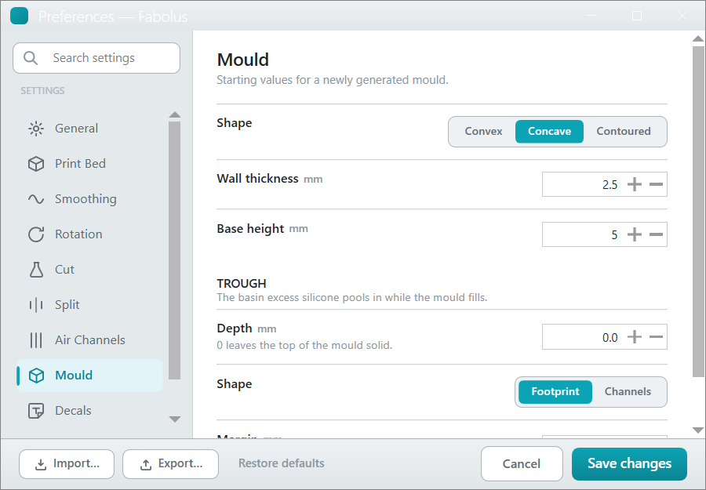
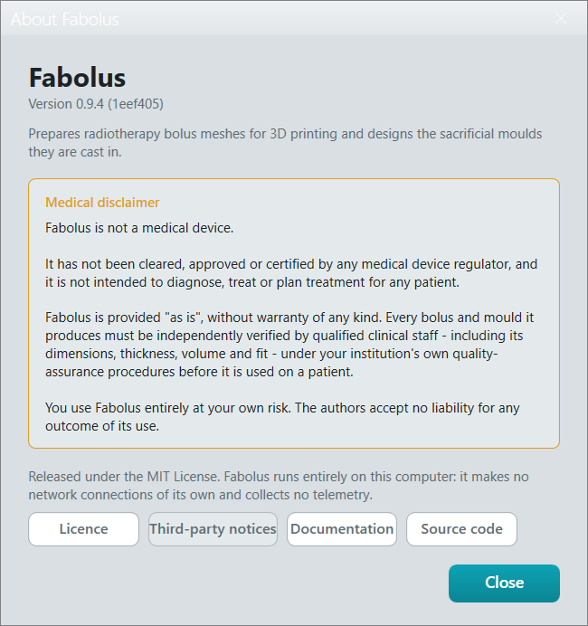

# Fabolus

> [!WARNING]
> **Fabolus is not a medical device.** It has not been cleared, approved or certified by any medical device regulator, and it is not intended to diagnose, treat or plan treatment for any patient. It is provided "as is", without warranty of any kind. Every bolus and mould it produces must be independently verified by qualified clinical staff (including its dimensions, thickness, volume and fit) under your institution's own quality-assurance procedures before it is used on a patient. You use Fabolus entirely at your own risk. The full wording is in [DISCLAIMER.txt](DISCLAIMER.txt).

**Fabolus** is a Windows app that helps radiation therapy teams prepare bolus meshes for 3D printing. Its specialty is smoothing the bolus surface without sacrificing volume, and designing a sacrificial mould for casting silicone into the prescribed bolus shape.

It imports a bolus exported from your treatment planning system (STL, 3MF, OBJ, OFF or PLY), smooths it, orients it for printing, adds air channels, and builds a mould around the bolus with the channels subtracted, ready to export for printing.

**Documentation:** the [user guide](https://nsmela.github.io/Fabolus/) walks through the whole workflow, from import to casting, and the [architecture manual](https://nsmela.github.io/Fabolus/architecture/01-system-architecture/) covers how it is built.

**Privacy:** Fabolus runs entirely on your computer. It makes no network connections of its own, collects no telemetry, and never uploads meshes or any other data.

## Download and install

Grab the latest files from the [Releases page](https://github.com/nsmela/Fabolus/releases). Fabolus is Windows 10 or later, 64-bit only.

| File | Who it's for | Requires |
|---|---|---|
| `Fabolus-<version>-setup.exe` | **Most people.** Installs to your user folder, adds a Start Menu shortcut, and uninstalls cleanly. No admin rights needed. | Nothing |
| `Fabolus-<version>-win-x64.zip` | Portable use if you already have .NET. Extract anywhere and run `Fabolus.exe`. Smallest download. | [.NET 10 Desktop Runtime (x64)](https://dotnet.microsoft.com/download/dotnet/10.0/runtime) |
| `Fabolus-<version>-win-x64-self-contained.zip` | Portable use on a machine with no .NET installed. Everything is bundled, so the download is much larger. | Nothing |

The builds are not code-signed yet, so Windows SmartScreen may warn that the publisher is unknown the first time you run the installer or `Fabolus.exe`. Choose **More info**, then **Run anyway**. Only do this for files downloaded from the Releases page above.

## Building from source

Fabolus needs the [.NET 10 SDK](https://dotnet.microsoft.com/download/dotnet/10.0) and its geometry library, [GeometryEngine](https://github.com/nsmela/GeometryEngine), checked out **beside** this repository:

```
<any folder>/
├── Fabolus/
└── GeometryEngine/
```

```powershell
git clone https://github.com/nsmela/Fabolus.git
git clone https://github.com/nsmela/GeometryEngine.git
git -C GeometryEngine checkout (Get-Content Fabolus/build/geometryengine.sha)
dotnet test Fabolus/Fabolus.sln -c Release -p:Platform=x64
```

[build/geometryengine.sha](build/geometryengine.sha) records the GeometryEngine commit CI builds against. To build against a checkout somewhere else, pass `-p:GeometryEngineRoot=<path>\` to `dotnet build` or `dotnet test` for an individual project. See [CONTRIBUTING.md](CONTRIBUTING.md) for more.

## Building a release

All three artifacts are produced by one script:

```powershell
pwsh ./build/publish.ps1
```

They land in `artifacts/`. Building the installer needs [Inno Setup 6](https://jrsoftware.org/isinfo.php) (`winget install JRSoftware.InnoSetup`); pass `-SkipInstaller` to build just the two zips without it. Pushing a `x.y.z` tag runs the same script in GitHub Actions and attaches the results to a draft release.

See [build/publishing.md](build/publishing.md) for the full release process, script options, and known rough edges.

## Licence

Fabolus is released under the [MIT License](LICENSE). The third-party components it builds on and redistributes keep their own licences, listed in [THIRD-PARTY-NOTICES.md](THIRD-PARTY-NOTICES.md).

## Screenshots

The workflow on a synthetic chin bolus, from import to export.

**Import and inspect.** Fabolus reports the mesh's volume, area and dimensions, and checks it is manifold and watertight before anything else happens.



**Smooth without losing volume.** The heat map shows how far the smoothed surface moved from the original, and the section view cuts through both to compare them.





**Orient for printing.** Overhangs are coloured as you rotate, so you can find the orientation that needs the least support.



**Place air channels and build the mould.** Channels let trapped air escape while the silicone fills; the mould is generated around the bolus with the channels cut through it.





**Label it.** Decals emboss a patient ID, volume or alignment marks into the mould or the bolus.



**Export.** The mould is exported as STL, or as a 3MF that keeps the full editing history so the project can be reopened and adjusted.



**Preferences and About.** Each tool's starting values are set in Preferences; the About window carries the version, the medical disclaimer and the licences.

 
