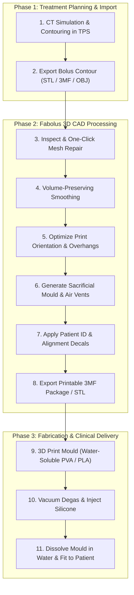

# Fabolus Wiki & Documentation

Welcome to the **Fabolus** project documentation. Fabolus is an open-source, specialized CAD/CAM application engineered for radiation oncology to assist medical physicists, radiation therapists, and clinical 3D printing engineers in designing patient-specific radiotherapy boluses and sacrificial silicone casting moulds.

<!-- IMAGE_PLACEHOLDER: [Figure 0.1: Fabolus Application Overview. Full-screen capture of the Fabolus main window displaying an anatomical bolus mesh loaded in the DirectX 3D viewport, with the step navigation header, interactive transform gizmo, and real-time physical properties panel.] -->

---

## Documentation Navigation

This documentation is organized into two primary tracks:
1. **[User & Clinical Guides](#user--clinical-guides)**: Step-by-step clinical workflows, algorithmic explanations, 3D printing parameters, and silicone casting protocols.
2. **[Architecture & Developer Manual](#architecture--developer-manual)**: System architecture, native C++ interop, the command-replay pipeline, domain models, and UI scene management.

---

## User & Clinical Guides

These guides cover the Fabolus workflow, from importing a bolus mesh exported from a Treatment Planning System (TPS) to exporting a print-ready mould. Slicing, printing, and casting happen in other tools.

| Document | Description |
| :--- | :--- |
| **[01. Overview](user-guide/01-clinical-overview.md)** | What Fabolus is for and the steps it covers between the TPS export and the 3D printer. |
| **[02. Quickstart Workflow](user-guide/02-quickstart-workflow.md)** | End-to-end walkthrough: Import → Smooth → Orient → Mould → Channels → Export. |
| **[03. Mesh Inspection & Repair](user-guide/03-mesh-inspection-and-repair.md)** | Reading the Info Panel (statistics and topology) and repairing a mesh in place. |
| **[04. Volume-Preserving Smoothing](user-guide/04-volume-preserving-smoothing.md)** | The double-offset smoothing, its controls, and the heat-map / cross-section / ghost display modes. |
| **[05. Print Orientation & Overhangs](user-guide/05-print-orientation-and-overhangs.md)** | Rotating the mesh and the overhang gradient with adjustable warning/critical angles. |
| **[06. Sacrificial Mould Design](user-guide/06-sacrificial-mould-design.md)** | Mould shapes (Convex, Concave, Contoured), wall/base/trough settings, and Generate/Clear Mould. |
| **[07. Air Channels](user-guide/07-air-channels-and-degassing.md)** | Straight, Angled, and Painted channels, their parameters, and how they are placed. |
| **[08. Cut & Split](user-guide/08-mould-splitting-and-cuts.md)** | Cutting a mesh along a plane into named halves (split for moulds is not yet implemented). |
| **[09. Export](user-guide/09-slicing-printing-and-casting.md)** | Exporting as STL or extended 3MF, and what a 3MF package contains. |

---

## Architecture & Developer Manual

Detailed technical specifications for software engineers extending or maintaining the Fabolus platform.

| Document | Description |
| :--- | :--- |
| **[01. System Architecture](architecture/01-system-architecture.md)** | Clean/Hexagonal Architecture: `Fabolus.Core` (domain), `Geometry.MeshLib` (native adapter), `Fabolus.Wpf` (presentation). |
| **[02. Command-Replay Pipeline](architecture/02-command-replay-pipeline.md)** | The immutable `IMeshCommand` pipeline, `CommandPriority`, cascading invalidation, and non-destructive replay against `BaseMesh`. |
| **[03. Geometry Engine & Native MeshLib](architecture/03-geometry-engine-and-meshlib.md)** | Integration with MeshInspector C++ `MeshLib`, unmanaged memory lifecycle, polygon offsetting via `Clipper2Lib`, and 3D swept tubes. |
| **[04. Domain Model & State Management](architecture/04-domain-model-and-workspace.md)** | The `Workspace` aggregate root, `IMesh` contract, `MeshMetadata` type-safe key-value system, and functional error handling (`Result<T>`). |
| **[05. WPF MVVM & Scene Managers](architecture/05-wpf-mvvm-and-scene-managers.md)** | CommunityToolkit.Mvvm patterns, decoupling DirectX 11 rendering via `ISceneManager`, and messaging with `WeakReferenceMessenger`. |
| **[06. 3MF Interchange Specification](architecture/06-3mf-interchange-specification.md)** | Custom XML schema (`fab:Commands`), base mesh resource embedding (`fab:role="basemesh"`), and lossless project round-tripping. |
| **[07. Testing Strategy & Benchmarks](architecture/07-testing-strategy.md)** | Unit and integration testing practices, `GeometryEngineFixture`, synthetic primitives, and anatomical test suites. |

---

## Reference & Appendices

- **[Clinical Glossary](reference/clinical-glossary.md)**: Radiotherapy and geometric terminology (Bolus, PTV, CTV, HU, Manifold, Degassing, Riser, Sprue).
- **[Configuration & Preferences](reference/configuration-and-preferences.md)**: Strongly-typed preference keys, print bed dimensions, rendering themes, and experimental feature flags.

---

## High-Level Clinical Workflow

