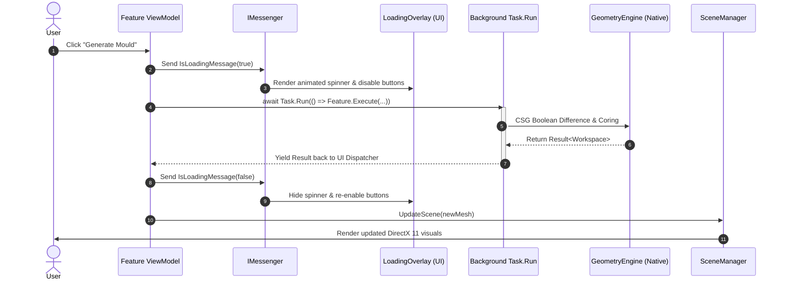

# System Architecture

## Architectural Philosophy: Clean / Hexagonal Design

Fabolus v1 is structured following the principles of **Clean Architecture** (also known as Ports & Adapters or Hexagonal Architecture). The overarching rule governing this design is the **Dependency Inversion Principle**: business rules and domain logic never depend on external frameworks, UI toolkits, or specific geometric computation kernels.

<!-- IMAGE_PLACEHOLDER: [Figure 10.1: Hexagonal Architecture Diagram for Fabolus. Architectural schematic illustrating Core domain entities encircled by ports/interfaces, surrounded by adapters (Geometry.MeshLib, Fabolus.Wpf, TestHarness). Dimensions: 900x500px.] -->

```
┌─────────────────────────────────────────────────────────────────────────┐
│                              Fabolus.Wpf                                │
│        Presentation Adapter: MVVM, MahApps.Metro, HelixToolkit SharpDX  │
└───────────────────┬─────────────────────────────────┬───────────────────┘
                    │ references                      │ references
                    ▼                                 ▼
┌─────────────────────────────────┐   ┌───────────────────────────────────┐
│          Fabolus.Core           │   │         Geometry.MeshLib          │
│         The Pure Domain         │   │       Native Engine Adapter       │
│  - Workspace Aggregate Root     │   │  - MeshInspector MeshLib (C++)    │
│  - IMesh & MeshMetadata Value   │   │  - Clipper2 2D Polygons           │
│  - IMeshCommand Replay Pipeline │   │  - Parallel Transport Frames      │
│  - Ports (IGeometryEngine, etc.)│   │  - Safe Unmanaged Memory Wrapping │
└───────────────────▲─────────────┘   └─────────────────▲─────────────────┘
                    │                                   │
                    └──────────── implements ───────────┘
```

---

## Detailed Component Breakdown

### 1. `Fabolus.Core` (`net8.0`)
- **Architectural Role**: The central, pure domain kernel.
- **Dependencies**: None. Contains zero references to WPF, DirectX, Windows Forms, or native DLLs. Can run unmodified on Linux or macOS.
- **Core Entities & Ports**:
  - **The Aggregate Root**: [`Workspace`](https://github.com/nsmela/Fabolus/blob/v1/src/Fabolus.Core/Geometry/Workspace.cs) manages collections of immutable meshes with strict structural integrity.
  - **The Geometry Abstraction**: [`IMesh`](https://github.com/nsmela/Fabolus/blob/v1/src/Fabolus.Core/Geometry/IMesh.cs) defines pure managed vertex and triangle arrays.
  - **The Metadata System**: [`MeshMetadata`](https://github.com/nsmela/Fabolus/blob/v1/src/Fabolus.Core/Geometry/Metadata/MeshMetadata.cs) provides a type-safe property dictionary using strongly-typed [`MetadataKey<T>`](https://github.com/nsmela/Fabolus/blob/v1/src/Fabolus.Core/Geometry/Metadata/MetadataKey.cs).
  - **The Command Replay Pipeline**: [`IMeshCommand`](https://github.com/nsmela/Fabolus/blob/v1/src/Fabolus.Core/Geometry/Metadata/IMeshCommand.cs) and [`CommandPriority`](https://github.com/nsmela/Fabolus/blob/v1/src/Fabolus.Core/Geometry/Metadata/CommandPriority.cs) govern non-destructive operations.
  - **Outward Ports**:
    - [`IGeometryEngine`](https://github.com/nsmela/Fabolus/blob/v1/src/Fabolus.Core/Geometry/IGeometryEngine.cs): Facade bundling all geometric operations.
    - [`IBooleans`](https://github.com/nsmela/Fabolus/blob/v1/src/Fabolus.Core/Geometry/IBooleans.cs), [`IGeometryModifiers`](https://github.com/nsmela/Fabolus/blob/v1/src/Fabolus.Core/Geometry/IGeometryModifiers.cs), [`IGeometryGenerators`](https://github.com/nsmela/Fabolus/blob/v1/src/Fabolus.Core/Geometry/IGeometryGenerators.cs), [`IGeometryEvaluators`](https://github.com/nsmela/Fabolus/blob/v1/src/Fabolus.Core/Geometry/IGeometryEvaluators.cs), [`IGeometryTransforms`](https://github.com/nsmela/Fabolus/blob/v1/src/Fabolus.Core/Geometry/IGeometryTransforms.cs), [`IGeometryIO`](https://github.com/nsmela/Fabolus/blob/v1/src/Fabolus.Core/Geometry/IGeometryIO.cs).
    - [`IFileSystem`](https://github.com/nsmela/Fabolus/blob/v1/src/Fabolus.Core/Common/Interfaces/IFileSystem.cs) and [`IDialogueSystem`](https://github.com/nsmela/Fabolus/blob/v1/src/Fabolus.Core/Common/Interfaces/IDialogueSystem.cs).

### 2. `Geometry.MeshLib` (`net8.0`)
- **Architectural Role**: High-performance native adapter implementing the geometry ports.
- **Dependencies**: `MeshLib` NuGet package (v3.1.2.192 native C++ binaries from MeshInspector), `Clipper2Lib` for planar offset clipping.
- **Memory Safety Contract**:
  - Implements the internal class [`MRMesh`](https://github.com/nsmela/Fabolus/blob/v1/src/Geometry.MeshLib/MRMesh.cs).
  - Translates managed vertex buffers into C++ `MR.Mesh` objects, executes native algorithms, marshals the resulting vertices back to pure C# memory, and deterministically disposes of all unmanaged pointers via `using` scopes.
  - Prevents C++ memory leaks from contaminating the long-running managed application.

### 3. `Fabolus.Wpf` (`net8.0-windows7.0`, target `win-x64`)
- **Architectural Role**: The presentation adapter providing an interactive desktop interface.
- **Dependencies**: `CommunityToolkit.Mvvm`, `MahApps.Metro`, `HelixToolkit.Wpf.SharpDX`.
- **Key Modules**:
  - **MVVM Pattern**: ViewModels maintain application state and dispatch domain workflows.
  - **Scene Managers**: The [`ISceneManager`](https://github.com/nsmela/Fabolus/blob/v1/src/Fabolus.Wpf/Features/Viewport/ISceneManager.cs) interface completely decouples ViewModels from HelixToolkit DirectX 11 visual elements (`MeshGeometryModel3D`, `DiffuseMaterialCore`).
  - **Inter-Component Messaging**: Event-driven decoupling using `WeakReferenceMessenger`.

---

## Concurrency & Threading Architecture

Geometric algorithms (e.g. morphological offsets on 300,000-triangle meshes or boolean cavity coring) are computationally intensive and cannot run on the UI thread without causing application freezing.

<!-- IMAGE_PLACEHOLDER: [Figure 10.2: Threading and Async Pipeline Sequence Diagram. Sequence diagram illustrating the interaction between ViewModel, Background Worker Task, Geometry Engine, and Viewport Dispatcher. Dimensions: 900x450px.] -->



1. **Non-Blocking Dispatch**: Every heavy operation (`SmoothMesh`, `GenerateMould`, `RepairMesh`, `ExportMesh`) is offloaded via `await Task.Run(...)`.
2. **Visual Feedback**: Before offloading, the ViewModel broadcasts an `IsLoadingMessage(true)` message, instructing the [`LoadingOverlay`](https://github.com/nsmela/Fabolus/blob/v1/src/Fabolus.Wpf/Features/Main/Controls/LoadingOverlay.xaml) to display a smooth, indeterminate circular progress animation while temporarily disabling input triggers.
3. **Dispatcher Marshaling**: Once the background worker completes, execution resumes on the WPF UI dispatcher to update observable properties and trigger viewport redrawing without cross-thread access exceptions.
