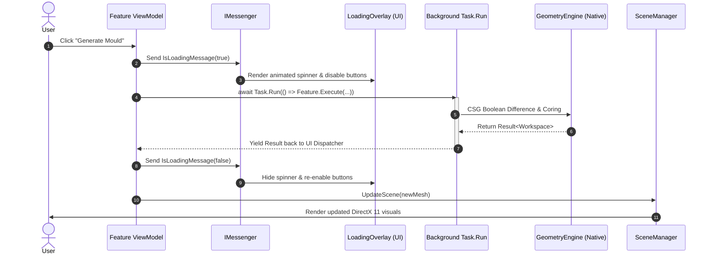

# System Architecture

## Architectural Philosophy: Vertical Slice Architecture & Functional Core

Fabolus v1 is organized using **Vertical Slice Architecture**, combined with a **functional approach centered on immutable domain models**.

Rather than splitting code across traditional horizontal technical layers (such as separate data, business, and presentation layers that cut across the whole project), Fabolus is partitioned into **feature-centric vertical slices**. Each slice encapsulates a complete, end-to-end user workflow:

- **Feature Slices**: `MeshIO` (Import & Repair), `Smoothing`, `Transforms` (Orientation), `Emboss` (Decals), `Moulding`, `AirChannels`, `CutSplit`, and `Export`.
- **Cohesive Feature Modules**: In `Fabolus.Core`, each feature houses its own domain commands and workflow orchestrators (e.g. `SmoothMesh`, `GenerateMould`, `RepairMesh`). In `Fabolus.Wpf`, each feature houses its dedicated View, ViewModel, SceneManager, and preference controls.
- **Low Coupling**: Features communicate through minimal shared abstractions—the `Workspace` aggregate root and loosely coupled messaging via `WeakReferenceMessenger`—allowing features to evolve independently without ripple effects.

<!-- IMAGE_PLACEHOLDER: [Figure 10.1: Vertical Slice Architecture Diagram for Fabolus. Diagram showing vertical feature slices (MeshIO, Smoothing, Orientation, Decals, Moulding, Cut/Split, Export) cutting across presentation (WPF), domain logic (Fabolus.Core), and the native geometry engine (Geometry.MeshLib).] -->

```
┌─────────────────────────────────────────────────────────────────────────────────────────────────────────────────┐
│                                           Fabolus.Wpf (Presentation)                                           │
│  ┌───────────────┐ ┌───────────────┐ ┌───────────────┐ ┌───────────────┐ ┌───────────────┐ ┌─────────────────┐  │
│  │ Mesh Manager  │ │   Smoothing   │ │  Orientation  │ │    Decals     │ │    Moulding   │ │   Cut & Split   │  │
│  │ View/VM/Scene │ │ View/VM/Scene │ │ View/VM/Scene │ │ View/VM/Scene │ │ View/VM/Scene │ │  View/VM/Scene  │  │
│  └───────┬───────┘ └───────┬───────┘ └───────┬───────┘ └───────┬───────┘ └───────┬───────┘ └────────┬────────┘  │
└──────────┼─────────────────┼─────────────────┼─────────────────┼─────────────────┼──────────────────┼───────────┘
           │                 │                 │                 │                 │                  │
┌──────────┼─────────────────┼─────────────────┼─────────────────┼─────────────────┼──────────────────┼───────────┐
│          ▼                 ▼                 ▼                 ▼                 ▼                  ▼           │
│  ┌───────────────┐ ┌───────────────┐ ┌───────────────┐ ┌───────────────┐ ┌───────────────┐ ┌─────────────────┐  │
│  │ MeshIO Feature│ │Smooth Feature │ │Transform Feat │ │ Decal Feature │ │ Mould Feature │ │Cut/Split Feature│  │
│  │ Import/Repair │ │  SmoothMesh   │ │ Rotate/Scale  │ │TextDecal/Wrap │ │ Generate/Clear│ │   Mesh Slices   │  │
│  └───────┬───────┘ └───────┬───────┘ └───────┬───────┘ └───────┬───────┘ └───────┬───────┘ └────────┬────────┘  │
│          │                 │                 │                 │                 │                  │           │
│          └─────────────────┴────────────┬────┴─────────────────┴─────────────────┴──────────────────┘           │
│                                         ▼                                                                       │
│                Immutable Functional Core: Workspace, IMesh, MeshMetadata, IMeshCommand, Result<T>               │
│                                         │                                                                       │
│                                  IGeometryEngine (Facade Interface)                                             │
└─────────────────────────────────────────┼───────────────────────────────────────────────────────────────────────┘
                                          │ implements
                                          ▼
┌─────────────────────────────────────────────────────────────────────────────────────────────────────────────────┐
│                                       Geometry.MeshLib (Native Adapter)                                         │
│                MeshInspector MeshLib (C++), Clipper2Lib, Memory Safety Boundaries & Buffer Marshaling           │
└─────────────────────────────────────────────────────────────────────────────────────────────────────────────────┘
```

---

## The Functional Approach: Immutability & Determinism

Fabolus treats 3D meshes, metadata, and workspace state as **immutable values** managed through pure, side-effect-free transformations and the functional `Result<T>` pattern.

### Why Immutability is Essential in Fabolus

1. **Clinical Safety & Auditability**:
   In radiation oncology, a patient-specific bolus is a prescribed medical device. Immutability guarantees that once a mesh state is computed, it cannot be silently modified by background processes, stale pointers, or UI side-effects. Every clinical state is an explicit, audit-safe value.

2. **Non-Destructive Pipeline & Cascading Invalidation**:
   Traditional CAD packages mutate vertex buffers destructively in place, making multi-step undo difficult and prone to numerical drift. In Fabolus, the original imported geometry is stored as an immutable `BaseMesh`. Operations like smoothing, orientation, decals, and mould cavities are immutable command records (`IMeshCommand`) evaluated on demand in priority order (`CommandPriority`). When an earlier stage is edited (e.g. changing rotation), downstream steps are cleanly invalidated and recomputed from the ground truth without accumulated distortion.

3. **Thread Safety for High-Performance Concurrency**:
   Mesh processing (such as morphological double offsets or CSG boolean subtractions on 500,000-triangle meshes) is computationally intensive. Because `Workspace`, `IMesh`, and commands are immutable, they can be freely passed across thread boundaries via `Task.Run` without complex locking, synchronization primitives, or data race hazards.

4. **Transactional State Rollback**:
   Every feature method returns a functional `Result<Workspace>` rather than throwing exceptions or leaving dirty state. If a geometric algorithm fails (e.g., non-manifold geometry produces an error during a boolean cut), the application discards the failure `Result` and keeps the previous valid immutable `Workspace` completely intact.

---

## Detailed Component Breakdown

### 1. `Fabolus.Core` (`net8.0`)
- **Architectural Role**: The central, pure domain kernel.
- **Dependencies**: None. Contains zero references to WPF, DirectX, Windows Forms, or native DLLs. Can run unmodified on Linux or macOS.
- **Core Entities & Ports**:
  - **The Aggregate Root**: [`Workspace`](https://github.com/nsmela/Fabolus/blob/v1/src/Fabolus.Core/Geometry/Workspace.cs) manages collections of immutable meshes with strict structural integrity.
  - **The Geometry Abstraction**: [`IMesh`](https://github.com/nsmela/Fabolus/blob/v1/src/Fabolus.Core/Geometry/IMesh.cs) defines pure managed vertex and triangle arrays.
  - **The Metadata System**: [`MeshMetadata`](https://github.com/nsmela/Fabolus/blob/v1/src/Fabolus.Core/Geometry/Metadata/MeshMetadata.cs) provides a type-safe property dictionary using strongly-typed [`MetadataKey<T>`](https://github.com/nsmela/Fabolus/blob/v1/src/Fabolus.Core/Geometry/Metadata/MetadataKey.cs).
  - **The Command Replay Pipeline**: [`IMeshCommand`](https://github.com/nsmela/Fabolus/blob/v1/src/Fabolus.Core/Geometry/Metadata/IMeshCommand.cs) and [`CommandPriority`](https://github.com/nsmela/Fabolus/blob/v1/src/Fabolus.Core/Geometry/Metadata/CommandPriority.cs) govern non-destructive operations.
  - **Outward Ports**:
    - [`IGeometryEngine`](https://github.com/nsmela/Fabolus/blob/v1/src/Fabolus.Core/Geometry/IGeometryEngine.cs): Facade bundling all geometric operations.
    - [`IBooleans`](https://github.com/nsmela/Fabolus/blob/v1/src/Fabolus.Core/Geometry/IBooleans.cs), [`IGeometryModifiers`](https://github.com/nsmela/Fabolus/blob/v1/src/Fabolus.Core/Geometry/IGeometryModifiers.cs), [`IGeometryGenerators`](https://github.com/nsmela/Fabolus/blob/v1/src/Fabolus.Core/Geometry/IGeometryGenerators.cs), [`IGeometryEvaluators`](https://github.com/nsmela/Fabolus/blob/v1/src/Fabolus.Core/Geometry/IGeometryEvaluators.cs), [`IGeometryTransforms`](https://github.com/nsmela/Fabolus/blob/v1/src/Fabolus.Core/Geometry/IGeometryTransforms.cs), [`IGeometryIO`](https://github.com/nsmela/Fabolus/blob/v1/src/Fabolus.Core/Geometry/IGeometryIO.cs).
    - [`IFileSystem`](https://github.com/nsmela/Fabolus/blob/v1/src/Fabolus.Core/Common/Interfaces/IFileSystem.cs) and [`IDialogueSystem`](https://github.com/nsmela/Fabolus/blob/v1/src/Fabolus.Core/Common/Interfaces/IDialogueSystem.cs).

### 2. `Geometry.MeshLib` (`net8.0`)
- **Architectural Role**: High-performance native adapter implementing the geometry ports.
- **Dependencies**: `MeshLib` NuGet package (v3.1.2.192 native C++ binaries from MeshInspector), `Clipper2Lib` for planar offset clipping.
- **Memory Safety Contract**:
  - Implements the internal class [`MRMesh`](https://github.com/nsmela/Fabolus/blob/v1/src/Geometry.MeshLib/MRMesh.cs).
  - Translates managed vertex buffers into C++ `MR.Mesh` objects, executes native algorithms, marshals the resulting vertices back to pure C# memory, and deterministically disposes of all unmanaged pointers via `using` scopes.
  - Prevents C++ memory leaks from contaminating the long-running managed application.

### 3. `Fabolus.Wpf` (`net8.0-windows7.0`, target `win-x64`)
- **Architectural Role**: The presentation adapter providing an interactive desktop interface.
- **Dependencies**: `CommunityToolkit.Mvvm`, `MahApps.Metro`, `HelixToolkit.Wpf.SharpDX`.
- **Key Modules**:
  - **MVVM Pattern**: ViewModels maintain application state and dispatch domain workflows.
  - **Scene Managers**: The [`ISceneManager`](https://github.com/nsmela/Fabolus/blob/v1/src/Fabolus.Wpf/Features/Viewport/ISceneManager.cs) interface completely decouples ViewModels from HelixToolkit DirectX 11 visual elements (`MeshGeometryModel3D`, `DiffuseMaterialCore`).
  - **Inter-Component Messaging**: Event-driven decoupling using `WeakReferenceMessenger`.

---

## Concurrency & Threading Architecture

Geometric algorithms (e.g. morphological offsets on 300,000-triangle meshes or boolean cavity coring) are computationally intensive and cannot run on the UI thread without causing application freezing.

<!-- IMAGE_PLACEHOLDER: [Figure 10.2: Threading and Async Pipeline Sequence Diagram. Sequence diagram illustrating the interaction between ViewModel, Background Worker Task, Geometry Engine, and Viewport Dispatcher. Dimensions: 900x450px.] -->



1. **Non-Blocking Dispatch**: Every heavy operation (`SmoothMesh`, `GenerateMould`, `RepairMesh`, `ExportMesh`) is offloaded via `await Task.Run(...)`.
2. **Visual Feedback**: Before offloading, the ViewModel broadcasts an `IsLoadingMessage(true)` message, instructing the [`LoadingOverlay`](https://github.com/nsmela/Fabolus/blob/v1/src/Fabolus.Wpf/Features/Main/Controls/LoadingOverlay.xaml) to display a smooth, indeterminate circular progress animation while temporarily disabling input triggers.
3. **Dispatcher Marshaling**: Once the background worker completes, execution resumes on the WPF UI dispatcher to update observable properties and trigger viewport redrawing without cross-thread access exceptions.
