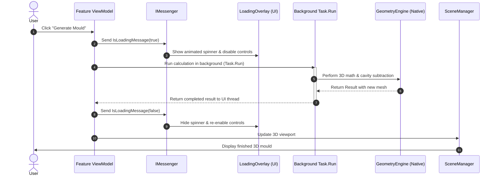

# System Architecture

## Architectural Philosophy: Vertical Slice Architecture & Functional Core

Fabolus v1 is organized using **Vertical Slice Architecture**, combined with a **functional approach centered on immutable (unchangeable) data**.

Instead of grouping code by technical layer (such as having all screens in one folder, all business rules in another, and all calculations elsewhere), Fabolus is organized by **feature**.

Each feature is a self-contained "vertical slice" that holds everything it needs from the user interface down to the 3D calculations:

- **Feature Slices**: `MeshIO` (Import & Repair), `Smoothing`, `Transforms` (Orientation), `Emboss` (Decals), `Moulding`, `AirChannels`, `CutSplit`, and `Export`.
- **Everything in one place**: For example, everything related to Smoothing (the slider controls, the 3D viewport tools, the calculation logic, and the user settings) lives together under the Smoothing feature.
- **Independent features**: Changes made to one feature (like Decals or Moulding) do not break or affect other features, making the application easier to test, maintain, and expand.

<!-- IMAGE_PLACEHOLDER: [Figure 10.1: Vertical Slice Architecture Diagram for Fabolus. Diagram showing vertical feature slices (MeshIO, Smoothing, Orientation, Decals, Moulding, Cut/Split, Export) cutting across presentation (WPF), domain logic (Fabolus.Core), and the geometry engine (GeometryEngine).] -->

```
┌─────────────────────────────────────────────────────────────────────────────────────────────────────────────────┐
│                                           Fabolus.Wpf (User Interface)                                          │
│  ┌───────────────┐ ┌───────────────┐ ┌───────────────┐ ┌───────────────┐ ┌───────────────┐ ┌─────────────────┐  │
│  │ Mesh Manager  │ │   Smoothing   │ │  Orientation  │ │    Decals     │ │    Moulding   │ │   Cut & Split   │  │
│  │ View/VM/Scene │ │ View/VM/Scene │ │ View/VM/Scene │ │ View/VM/Scene │ │ View/VM/Scene │ │  View/VM/Scene  │  │
│  └───────┬───────┘ └───────┬───────┘ └───────┬───────┘ └───────┬───────┘ └───────┬───────┘ └────────┬────────┘  │
└──────────┼─────────────────┼─────────────────┼─────────────────┼─────────────────┼──────────────────┼───────────┘
           │                 │                 │                 │                 │                  │
┌──────────┼─────────────────┼─────────────────┼─────────────────┼─────────────────┼──────────────────┼───────────┐
│          ▼                 ▼                 ▼                 ▼                 ▼                  ▼           │
│  ┌───────────────┐ ┌───────────────┐ ┌───────────────┐ ┌───────────────┐ ┌───────────────┐ ┌─────────────────┐  │
│  │ MeshIO Feature│ │Smooth Feature │ │Transform Feat │ │ Decal Feature │ │ Mould Feature │ │Cut/Split Feature│  │
│  │ Import/Repair │ │  SmoothMesh   │ │ Rotate/Scale  │ │TextDecal/Wrap │ │ Generate/Clear│ │   Mesh Slices   │  │
│  └───────┬───────┘ └───────┬───────┘ └───────┬───────┘ └───────┬───────┘ └───────┬───────┘ └────────┬────────┘  │
│          │                 │                 │                 │                 │                  │           │
│          └─────────────────┴────────────┬────┴─────────────────┴─────────────────┴──────────────────┘           │
│                                         ▼                                                                       │
│               Immutable Core: Workspace, MeshRecord, IMesh, IMeshCommand, Result<T>                            │
│                                         │                                                                       │
│                                  IGeometryEngine (Geometry Interface)                                           │
└─────────────────────────────────────────┼───────────────────────────────────────────────────────────────────────┘
                                          │ implements
                                          ▼
┌─────────────────────────────────────────────────────────────────────────────────────────────────────────────────┐
│                                    GeometryEngine (separate library)                                            │
│              Manifold kernel (C++) with a managed BSP fallback, Clipper2 planar operations                      │
└─────────────────────────────────────────────────────────────────────────────────────────────────────────────────┘
```

---

## The Functional Approach: Immutability & Determinism

Fabolus treats 3D models and project state as **immutable values**.

### What does "immutable" mean?

**Immutable** simply means **unchangeable**. Once a 3D mesh or project state is created in memory, it is never modified or overwritten in place.

When you perform an action (such as smoothing a surface or rotating a model), Fabolus does not alter the existing mesh. Instead, it creates a fresh, new version of the mesh with that change applied, keeping the previous version untouched.

### Why Immutability is Important in Fabolus

1. **Patient Safety & Clinical Accuracy**:
   In radiation therapy, patient boluses are prescribed medical devices with precise thickness and contour requirements. Immutability guarantees that once a 3D shape is generated and checked, it cannot be accidentally changed by background tasks or unintended side effects.

2. **Non-Destructive Editing & Easy Undo**:
   Traditional CAD software modifies 3D shapes directly, which can make undoing actions difficult and introduce tiny numerical errors over time. Because Fabolus never destroys the original imported mesh (`BaseMesh`), you can change earlier settings (such as rotation or smoothing) at any time. Fabolus simply recalculates forward from the original shape without any loss of quality.

3. **Smooth Multi-Tasking & Stability (Thread Safety)**:
   Heavy 3D calculations (like hollowing out a mould or smoothing hundreds of thousands of triangles) take several seconds and run in the background. Because background tasks work on their own unchangeable copy of the data, they never conflict with the 3D viewport or freeze the user interface.

4. **Safe Error Recovery**:
   If an operation fails (for example, if a defective mesh causes an error during mould carving), nothing is corrupted. Fabolus safely discards the failed attempt and keeps your previous workspace state completely intact.

---

## How Mesh Modifications are Handled & Stored

In Fabolus, modifications are never permanently "baked" into the base mesh during editing. Instead, they are stored as a **recipe of modification commands** (`IMeshCommand`) managed by the **Command Replay Pipeline**:

- **Preserved Base Mesh**: The original imported file is kept untouched as the `BaseMesh`.
- **Saved Modification List**: Every action you perform (such as smoothing, rotating, adding decals, or generating mould walls) is saved as an individual command record.
- **Ordered Replay (`CommandPriority`)**: Whenever Fabolus needs to display or export the model, it runs the saved commands in a fixed, logical order:
  1. **Transform**: Orient and position the mesh.
  2. **Smoothing**: Apply volume-preserving smoothing.
  3. **Decals**: Add patient identifier and volume labels.
  4. **Moulding**: Build the mould shell, place air channels, and carve the cavity.
- **Lossless Project Files**: When you export a `.3mf` project file, Fabolus embeds both the original base mesh and this complete list of modification commands. When reopened, the exact editing history is restored so you can adjust any setting.

---

## Detailed Component Breakdown

The codebase is split into three focused projects:

### 1. `Fabolus.Core` (`net8.0`)
- **Role**: The core domain library containing all business logic, feature commands, and data models.
- **Dependencies**: None. It has zero references to Windows, WPF, DirectX, or native DLLs. It can run on any platform (Windows, macOS, Linux).
- **Key Components**:
  - **`Workspace`**: The central container managing the collection of meshes and keeping track of the active model.
  - **`IMesh`**: The lightweight representation of 3D geometry (vertices and triangle faces).
  - **`MeshRecord`**: The workspace entry beside each mesh — its identity, name and command history. Readable without touching raw 3D geometry, and unaffected by operations that replace the geometry entirely.
  - **`IMeshCommand` & Replay Pipeline**: Manages and stores all non-destructive editing commands.
  - **`IGeometryEngine`**: The shared interface defining all 3D operations (smoothing, booleans, transforms, repair, and file import/export) without depending on how they are implemented.

### 2. `GeometryEngine` (`net8.0`, [separate repository](https://github.com/nsmela/GeometryEngine))
- **Role**: Every geometric operation Fabolus performs — booleans, offsets, smoothing, decimation, spatial queries, polygon work and mesh files.
- **Dependencies**: the **Manifold** kernel (native C++, shipped with the library alongside oneTBB) with a fully managed BSP fallback, plus `Clipper2` and `NetTopologySuite` for planar work.
- **Why it is a separate library**: it has no idea what a bolus or a mould is. That lets its geometry be tested on its own terms — against analytic volume identities and real clinical meshes — without a workspace or a window involved, and keeps Fabolus from growing geometry code of its own.
- **Meshes are values, not resources**: `ImmutableMesh` cannot be constructed in an invalid state and is not `IDisposable`. No marshalling boundary, no ownership contract, no disposal for callers to get wrong.

### 3. `Fabolus.Wpf` (`net8.0-windows7.0`, target `win-x64`)
- **Role**: The desktop user interface application for Windows.
- **Dependencies & Why They Are Used**:
  - **`CommunityToolkit.Mvvm`**: Provides the standard MVVM (Model-View-ViewModel) architecture. It automatically connects screen controls (buttons, sliders, inputs) to background logic without messy event code, keeping the UI responsive and clean.
  - **`MahApps.Metro`**: Supplies the modern desktop visual styling, theme management (dark and light modes), and advanced controls like the dual-thumb range slider for overhang angles.
  - **`HelixToolkit.Wpf.SharpDX`**: Powers the 3D viewport using DirectX 11. It renders complex models (hundreds of thousands of triangles) with real-time lighting, interactive rotation rings, cross-section clipping planes, and color gradients at smooth frame rates.
- **Key Modules**:
  - **Scene Managers (`ISceneManager`)**: Separates the ViewModel code from DirectX rendering details, so ViewModels focus on application logic rather than 3D graphics code.
  - **Messaging (`WeakReferenceMessenger`)**: Allows different parts of the application (like toolbars and info panels) to communicate without tight connections between them.

---

## Concurrency & Responsive User Interface

Large 3D mesh operations (like smoothing a 300,000-triangle mesh or carving a mould cavity) take significant processing power. If run on the main thread, the entire program would freeze.

Fabolus keeps the user interface smooth and responsive using background tasks:

<!-- IMAGE_PLACEHOLDER: [Figure 10.2: Threading and Async Pipeline Sequence Diagram. Sequence diagram illustrating the interaction between ViewModel, Background Worker Task, Geometry Engine, and Viewport Dispatcher. Dimensions: 900x450px.] -->



1. **Background Processing**: Heavy 3D calculations run on background threads (`await Task.Run(...)`), preventing the user interface from locking up.
2. **Visual Feedback**: While working, Fabolus displays an animated loading spinner (`LoadingOverlay`) and temporarily disables buttons to prevent accidental double-clicks.
3. **Safe UI Updates**: Once the calculation completes, the results are safely handed back to the main UI thread to refresh the 3D viewport.
