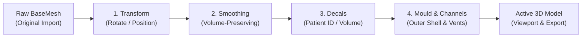

# Command-Replay Pipeline & Immutability

## Destructive Modeling vs. Parametric Command Replay

In general-purpose 3D software (such as Blender, Meshmixer, or MeshLab), geometry edits are applied **destructively**:
- Translating or rotating a mesh directly alters its raw vertex coordinates.
- Smoothing directly moves points on the surface, making it difficult to undo without losing shape.
- Boolean cuts permanently modify and slice triangle faces.

In clinical radiation oncology, destructive modeling introduces major risks:
1. **Compounding Errors**: If an operator adjusts smoothing intensity from 1.0 mm to 1.2 mm, a destructive tool smooths over the already-smoothed geometry. The edits stack, causing unwanted thinning of the prescribed bolus.
2. **Out-of-Sync Moulds**: If a user designs a sacrificial mould and then rotates the bolus by 5° to avoid print overhangs, a destructive tool leaves the mould un-rotated, producing an invalid mould.
3. **Excessive Memory Use**: Saving full copies of large 3D models (often hundreds of thousands of triangles) for every undo step quickly exhausts computer memory.

**Fabolus solves this by using a non-destructive Command-Replay Pipeline.**

<!-- IMAGE_PLACEHOLDER: [Figure 11.1: The Command Replay Pipeline. Diagram illustrating the pristine BaseMesh flowing through Transform, Smoothing, Decals, and Mould generation stages.] -->

---

## How the Pipeline Works

Rather than permanently changing 3D geometry, Fabolus stores the original imported mesh as an untouched **`BaseMesh`**, paired with an ordered list of **modification commands**.



Whenever Fabolus needs to display the mesh or export a print file, it starts with the untouched base mesh and applies each command in sequence.

---

## Two Core Rules of the Pipeline

### 1. Replacement, Not Stacking
When you adjust a setting (such as changing smoothing intensity or tweaking rotation):
- Fabolus updates that specific command in place rather than stacking a second command on top.
- Multiple adjustments to the same step never degrade the model or compound errors.

### 2. Automatic Cleanup (Cascading Invalidation)
Each command belongs to an ordered priority tier:

```
Priority 10: Transform (Rotate & Position)
Priority 15: Text Decals on Bolus
Priority 20: Sacrificial Mould & Air Channels
Priority 25: Text Decals on Mould
```

If you edit or reset a step, **all downstream steps with higher priority are automatically cleared**:

```
Base Mesh ──► [Transform (Rotate)] ──► [Smoothing] ──► [Decals] ──► [Mould & Channels]
                      ▲
       If you edit rotation here...
                      │
                      └──► Mould & Channels are cleared because they depended
                           on the old orientation.
```

- **Clinical Example**: A user configures a mould with air channels (Priority 20). If they later return to the **rotate** tab and change the orientation (Priority 10), the pipeline automatically clears the mould and channels. This prevents the user from accidentally printing a mould that doesn't match the rotated bolus.

---

## The `IMeshCommand` Interface

In code, every operation implements the simple [`IMeshCommand`](https://github.com/nsmela/Fabolus/blob/v1/src/Fabolus.Core/Geometry/Metadata/IMeshCommand.cs) interface:

```csharp
public interface IMeshCommand
{
    int Priority { get; }
    Result<IMesh> Apply(IGeometryEngine engine, IMesh mesh);
}
```

- **`Priority`**: Defines where the command runs in the pipeline.
- **`Apply`**: Takes an input mesh, performs the calculation, and returns a new updated mesh without modifying the original input.

### Execution Loop ([`CommandReplay.cs`](https://github.com/nsmela/Fabolus/blob/v1/src/Fabolus.Core/Geometry/Metadata/CommandReplay.cs))

Replaying commands against the base mesh is straightforward:

```csharp
public static Result<IMesh> Apply(IGeometryEngine engine, IMesh baseMesh, IEnumerable<IMeshCommand> commands) {
    IMesh current = baseMesh;
    foreach (var command in commands) {
        var result = command.Apply(engine, current);
        if (result.IsFailure) return result.Error;
        current = result.Value;
    }
    return Result<IMesh>.Success(current);
}
```

---

## Previewing Geometry at Earlier Steps (`GetMeshAtStage`)

To support comparison views (such as showing the original unsmoothed mesh alongside the smoothed mesh in cross-section mode), Fabolus can evaluate geometry at any point in its history:

```csharp
public static Result<IMesh> GetMeshAtStage(IGeometryEngine engine, IMesh currentMesh, int priorityLevel)
```

This replays commands only up to the requested priority level, providing an instant visual snapshot without altering the current project state.
