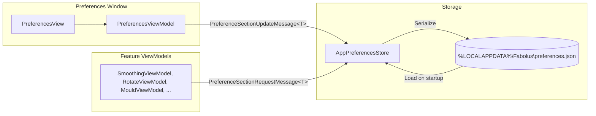

# Configuration & Preferences Reference

Fabolus stores user preferences as JSON and shares them with the ViewModels that need them through the CommunityToolkit `WeakReferenceMessenger` (a request/reply message per settings section), rather than through a shared singleton reference.

Preferences are organised into **sections**. Each section is an immutable record implementing `IPreferenceSettings<TSelf>` that knows how to read itself from, and write itself to, a flat `PreferenceBag`. Following the "each feature owns its preferences" refactor, the sections live with their features:

- **`GeneralPreferences`** — import/export folders, export format, viewport background.
- **`PrintBedPreferences`** — print bed size, bed grid, and channel defaults.
- **`SmoothingPreferences`** — smoothing parameters and display mode.
- **`RotationPreferences`** — overhang warning/critical angles.
- **`MouldPreferences`** — mould shape, wall/base sizing, and trough.
- **`DecalPreferences`** — decal enable, auto-placement, and text defaults.
- **`CutSplitPreferences`** — cut/split view availability and scope.

---

## Architecture & Data Flow



A feature ViewModel requests its section with `PreferenceSectionRequestMessage<T>` (there is a `messenger.GetPreference<T>(fallback)` extension that supplies a fallback if nothing answers); feature views seed their controls from it on activation. The preferences window sends a `PreferenceSectionUpdateMessage<T>` when the user saves; `AppPreferencesStore` applies it and writes the file.

### Storage Location & File Format

Preferences are stored at `PreferenceStorageLocation.DefaultPath`:

```text
%LOCALAPPDATA%\Fabolus\preferences.json
```

typically resolving to `C:\Users\<Username>\AppData\Local\Fabolus\preferences.json`.

The file is a flat JSON object keyed by each setting's storage key. Enums are written as their **name** (e.g. `"Stl"`, `"Graphite"`, `"Concave"`), not as integers. A value that is missing, the wrong type, or out of range falls back to that setting's shipped default — it is **not** clamped to the nearest bound. Keys the current build does not recognise are preserved and written back out.

---

## Preference Keys

Types marked *enum* are written as their value name. Ranges, where shown, are the values a stored setting must fall within to be accepted.

### `GeneralPreferences` ([source](https://github.com/nsmela/Fabolus/blob/v1/src/Fabolus.Wpf/Features/AppPreferences/GeneralPreferences.cs))

| Storage Key | Type | Default | Notes |
| :--- | :--- | :--- | :--- |
| `default_import_folder` | string | Common Documents folder | Falls back to default if the stored folder no longer exists. |
| `default_export_folder` | string | Local Application Data folder | Falls back to default if the stored folder no longer exists. |
| `default_export_format` | enum | `Stl` | `Stl`, `ThreeMF`. |
| `viewport_background` | enum | `Graphite` | `Graphite`, `LightSteel`. |

### `PrintBedPreferences` ([source](https://github.com/nsmela/Fabolus/blob/v1/src/Fabolus.Wpf/Features/AppPreferences/PrintBedPreferences.cs))

| Storage Key | Type | Default | Range |
| :--- | :--- | :--- | :--- |
| `print_bed_width` | float | `250.0` | `50`–`1000` |
| `print_bed_depth` | float | `250.0` | `50`–`1000` |
| `show_bed_grid` | bool | `true` | — |
| `autodetect_channels` | bool | `true` | — |
| `channel_diameter` | float | `4.0` | `1`–`20` |

The print bed stores width and depth only; there is no stored bed-height preference.

### `SmoothingPreferences` ([source](https://github.com/nsmela/Fabolus/blob/v1/src/Fabolus.Wpf/Features/Smoothing/SmoothingPreferences.cs))

| Storage Key | Type | Default | Range |
| :--- | :--- | :--- | :--- |
| `smooth_iterations` | int | `1` | `0`–`10` |
| `smooth_intensity` | float | `2.0` | `0`–`20` |
| `smooth_inflation` | float | `0.1` | `0`–`1` |
| `smooth_remesh_ratio` | float | `2.0` | `1`–`10` |
| `smooth_resolution` | float | `1.0` | `0.5`–`4` |
| `smooth_display_mode` | enum | `None` | `None`, `CrossSection`, `Heatmap` |

### `RotationPreferences` ([source](https://github.com/nsmela/Fabolus/blob/v1/src/Fabolus.Wpf/Features/Rotatation/RotationPreferences.cs))

| Storage Key | Type | Default | Range |
| :--- | :--- | :--- | :--- |
| `overhang_warning_angle` | float | `45.0` | `30`–`90` |
| `overhang_critical_angle` | float | `65.0` | `30`–`90` |

The two angles are kept at least 5° apart.

### `MouldPreferences` ([source](https://github.com/nsmela/Fabolus/blob/v1/src/Fabolus.Wpf/Features/Moulding/MouldPreferences.cs))

| Storage Key | Type | Default | Range |
| :--- | :--- | :--- | :--- |
| `mould_shape` | enum | `Concave` | `Convex`, `Concave`, `Contoured` |
| `mould_wall_thickness` | float | `2.5` | `0.5`–`15` |
| `mould_base_height` | float | `5.0` | `2`–`20` |
| `mould_trough_height` | float | `0.0` | `0`–`20` |
| `mould_trough_offset` | float | `2.5` | `0.5`–`15` |
| `mould_trough_shape` | enum | `Footprint` | `Footprint`, `Channels` |

### `DecalPreferences` ([source](https://github.com/nsmela/Fabolus/blob/v1/src/Fabolus.Wpf/Features/Emboss/DecalPreferences.cs))

| Storage Key | Type | Default | Notes |
| :--- | :--- | :--- | :--- |
| `decals_enabled` | bool | `true` | Enables the decals step. |
| `decal_autoplace_scope` | enum | `Mould` | `Mould`, `Base`, `MouldAndBase`, `BaseIfNoMould`. |
| `decal_autoplace_filename` | bool | `true` | Auto-place a filename decal. |
| `decal_filename_anchor` | enum | `Front` | `Top`, `Front`, `Back`, `Left`, `Right`, `Curve1`, `Curve2`. |
| `decal_autoplace_volume` | bool | `true` | Auto-place a volume decal. |
| `decal_volume_anchor` | enum | `Back` | Same anchors as above. |
| `decal_default_font` | enum | `Sans` | `Sans`, `Mono`, `Bold`. |
| `decal_default_cap_height` | float | `6.0` | `4`–`20` |
| `decal_default_depth` | float | `0.8` | `0.1`–`2` |
| `decal_default_operation` | enum | `Engrave` | `Emboss`, `Engrave`. |

### `CutSplitPreferences` ([source](https://github.com/nsmela/Fabolus/blob/v1/src/Fabolus.Wpf/Features/CutSplit/CutSplitPreferences.cs))

| Storage Key | Type | Default | Notes |
| :--- | :--- | :--- | :--- |
| `cut_view_enabled` | bool | `false` | Enables the cut view. |
| `cut_view_scope` | enum | `Base` | `Base`, `Mould`, `Both`. |
| `split_view_enabled` | bool | `false` | Enables the split view. |

---

## Export Format

`default_export_format` selects the format used when exporting a mesh:

- **`Stl`** — geometry only.
- **`ThreeMF`** — Fabolus's extended 3MF, which additionally embeds the command history and base mesh so a project can be re-opened and re-edited. See [3MF Interchange Specification](../architecture/06-3mf-interchange-specification.md).
