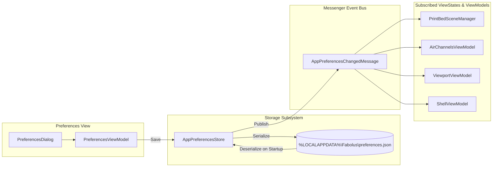

# Configuration & Preferences Reference

Fabolus provides a centralized, strongly-typed preferences subsystem in `Fabolus.Wpf.Features.AppPreferences`. Settings are stored locally on the user's workstation in JSON format and synchronized across ViewModels, ViewStates, and DirectX 3D renderers via `IAppPreferencesStore` and the CommunityToolkit `WeakReferenceMessenger`.

---

## 1. Preferences Architecture & Data Flow



### Storage Location & File Format
Preferences are stored on the local machine at:
```text
%LOCALAPPDATA%\Fabolus\preferences.json
```
typically resolving to `C:\Users\<Username>\AppData\Local\Fabolus\preferences.json`.

If the file does not exist (such as on first launch) or contains corrupted JSON, `AppPreferencesStore` automatically falls back to factory defaults without throwing unhandled exceptions.

```json
{
  "ImportFolder": "C:\\Users\\MedicalPhysicist\\Documents\\DICOM_Exports",
  "ExportFolder": "C:\\Users\\MedicalPhysicist\\Documents\\3D_Print_Jobs",
  "ExportFormat": 1,
  "PrintbedWidth": 256.0,
  "PrintbedDepth": 256.0,
  "PrintbedHeight": 256.0,
  "ShowBedGrid": true,
  "AutodetectChannels": true,
  "ChannelDiameter": 4.0,
  "AccentColor": "#FF0CA3B4",
  "ViewportBackground": 0,
  "Units": 0,
  "EnableCut": false,
  "EnableSplit": false
}
```

---

## 2. Preference Keys Reference

All keys are defined as static constants in [`PreferenceKeys.cs`](file:///c:/Users/nsmel/Documents/Programming/Fabolus/src/Fabolus.Wpf/Features/AppPreferences/AppPreferences.cs#L69):

| Key Name | Data Type | Default Value | Clinical & Operational Description |
| :--- | :--- | :--- | :--- |
| `ImportFolder` | `string` | `CommonDocuments` | Default directory opened when launching the file import dialog (`Ctrl+O`). |
| `ExportFolder` | `string` | `LocalApplicationData` | Default destination folder for exported `.3mf` archives and `.stl` mould meshes. |
| `ExportFormat` | `ExportFormat` enum | `Stl` (`0`) | Default export format (`Stl` or `ThreeMf`). Clinical default is `ThreeMf` for full parametric metadata. |
| `PrintbedWidth` | `float` | `250.0 mm` | Bounding width ($X$) of the virtual 3D printer build plate rendered in the 3D viewport. |
| `PrintbedDepth` | `float` | `250.0 mm` | Bounding depth ($Y$) of the virtual 3D printer build plate rendered in the 3D viewport. |
| `PrintbedHeight` | `float` | `300.0 mm` | Maximum build height ($Z$) bounding envelope of the virtual printer volume. |
| `ShowBedGrid` | `bool` | `true` | Toggles the visibility of the $10\text{ mm}$ grid lines on the virtual print bed plane. |
| `AutodetectChannels` | `bool` | `true` | When `true`, clicking a surface point automatically casts a ray along the surface normal $\vec{n}$ to place air vents. |
| `ChannelDiameter` | `float` | `4.0 mm` | Initial default bore diameter for newly placed straight and angled degassing channels. |
| `AccentColor` | `string` | `#FF0CA3B4` | Primary brand accent hex color used for buttons, active tabs, and gizmo highlights. |
| `ViewportBackground`| `ViewportBackground` enum | `Graphite` (`0`) | 3D scene backdrop preset: `Graphite` (neutral dark), `DarkSlate` (high contrast), `StudioLight` (print QA). |
| `Units` | `MeasurementUnit` enum | `Millimeters` (`0`) | Measurement system: `Millimeters` ($0$) or `Inches` ($1$). Radiation therapy default is strictly `Millimeters`. |
| `EnableCut` | `bool` | `false` | **Feature Flag**: Enables experimental interactive planar cutting tools in the viewport. |
| `EnableSplit` | `bool` | `false` | **Feature Flag**: Enables the Split View tab in the main navigation shell for multi-part mould disassembly. |

---

## 3. Printer Presets & Bed Sizing

<!-- IMAGE_PLACEHOLDER: [Figure 18.1: Preferences Window Tour. Screenshot of the Preferences dialog displaying the General, Print Bed, Air Channels, Appearance, and Experimental tabs, highlighting printer build plate configuration and feature flags.] -->

To ensure that mould assemblies fit comfortably within your department's additive manufacturing hardware, configure `PrintbedWidth`, `PrintbedDepth`, and `PrintbedHeight` according to your specific printer:

| Printer Model | Build Width ($X$) | Build Depth ($Y$) | Build Height ($Z$) | Recommended Filament Material |
| :--- | :--- | :--- | :--- | :--- |
| **Bambu Lab X1-Carbon / P1S** | `256 mm` | `256 mm` | `256 mm` | Water-Soluble PVA, Tough PLA |
| **Prusa MK4 / MK3S+** | `250 mm` | `210 mm` | `220 mm` | Water-Soluble BVOH, PETG |
| **Prusa XL (Single/Multi-Head)** | `360 mm` | `360 mm` | `360 mm` | PVA / PLA Multi-Material |
| **UltiMaker S5 / S7** | `330 mm` | `240 mm` | `300 mm` | UltiMaker PVA, Breakaway |
| **Elegoo Neptune 4 Max** | `420 mm` | `420 mm` | `480 mm` | Large-format Pelvis/Torso moulds |

> [!TIP]
> Always set your Fabolus print bed dimensions approximately $5\text{ mm}$ smaller than the manufacturer's nominal physical volume (e.g., $251\text{ mm}$ instead of $256\text{ mm}$ on Bambu Lab) to account for slicer exclusion zones, purge towers, and bed-clip clearance.

---

## 4. Feature Flags & Experimental Tools

Fabolus employs feature flags to safely isolate complex geometric operations that are undergoing clinical validation or active development:

### `EnableCut`
- **Purpose**: Activates the interactive clipping and slicing gizmo in the 3D viewport.
- **Underlying Engine**: Calls `CutMeshFeature` within `Fabolus.Core.Services` to slice watertight geometry along an arbitrary mathematical plane $\Pi: \vec{n} \cdot \vec{x} + d = 0$.
- **Clinical Safety Note**: Disabled by default in production clinical environments until two-part mould interlocking keys have completed physical registration audits.

### `EnableSplit`
- **Purpose**: Controls the visibility of the "Split" step in the primary navigation header of `MainWindow.xaml`.
- **Underlying Engine**: Manages the lifecycle of `SplitViewModel` and `SplitSceneManager`. When enabled, allows physicists to split monolithic sacrificial moulds into two or more rigid shell halves for non-soluble demoulding.

