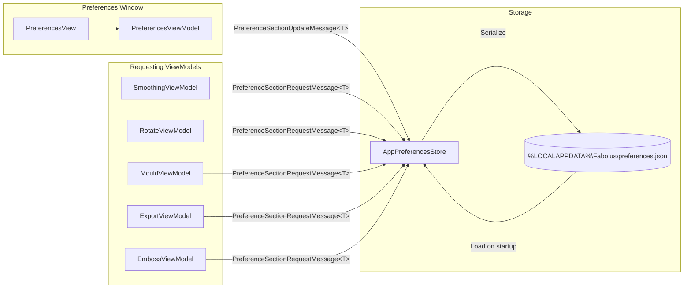

# Configuration & Preferences Reference

Fabolus stores user preferences in `Fabolus.Wpf.Features.AppPreferences`. Settings are persisted locally as JSON and shared with the ViewModels that need them through the CommunityToolkit `WeakReferenceMessenger` (a request/reply message per settings section), rather than through a shared singleton reference.

Preferences are organised into **sections**, each a small immutable record implementing `IPreferenceSettings<TSelf>` that knows how to read itself from, and write itself to, a flat `PreferenceBag`. On v1 there are two sections:

- **`GeneralPreferences`** — import/export folders, export format, viewport background.
- **`PrintBedPreferences`** — print bed size, bed grid, and air-channel defaults.

---

## 1. Preferences Architecture & Data Flow



A consumer asks for a section with `PreferenceSectionRequestMessage<T>` (there is a `messenger.GetPreference<T>(fallback)` extension that supplies a fallback if nothing answers). The preferences window sends a `PreferenceSectionUpdateMessage<T>` when the user saves; `AppPreferencesStore` applies it and writes the file.

### Storage Location & File Format

Preferences are stored at `PreferenceStorageLocation.DefaultPath`:

```text
%LOCALAPPDATA%\Fabolus\preferences.json
```

typically resolving to `C:\Users\<Username>\AppData\Local\Fabolus\preferences.json`.

The file is a flat JSON object keyed by each setting's storage key. Enums are written as their **name** (e.g. `"Stl"`, `"Graphite"`), not as integers. A value that is missing, the wrong type, or out of range falls back to that setting's shipped default — it is **not** clamped to the nearest bound. Keys the current build does not recognise are preserved and written back out, so a file written by a newer build keeps its extra settings after an older build saves over it.

```json
{
  "default_import_folder": "C:\\Users\\MedicalPhysicist\\Documents",
  "default_export_folder": "C:\\Users\\MedicalPhysicist\\AppData\\Local",
  "default_export_format": "Stl",
  "viewport_background": "Graphite",
  "print_bed_width": 250,
  "print_bed_depth": 250,
  "show_bed_grid": true,
  "autodetect_channels": true,
  "channel_diameter": 4
}
```

---

## 2. Preference Keys Reference

### `GeneralPreferences` ([`GeneralPreferences.cs`](https://github.com/nsmela/Fabolus/blob/v1/src/Fabolus.Wpf/Features/AppPreferences/GeneralPreferences.cs))

| Storage Key | Type | Default | Description |
| :--- | :--- | :--- | :--- |
| `default_import_folder` | `string` | `CommonDocuments` folder | Default directory opened by the file import dialog. Falls back to the default if the stored folder no longer exists. |
| `default_export_folder` | `string` | `LocalApplicationData` folder | Default destination for exported meshes. Falls back to the default if the stored folder no longer exists. |
| `default_export_format` | `ExportFormat` enum | `Stl` | Default export format. Values: `Stl`, `ThreeMF`. |
| `viewport_background` | `ViewportBackground` enum | `Graphite` | 3D viewport backdrop. Values: `Graphite`, `LightSteel`. |

### `PrintBedPreferences` ([`PrintBedPreferences.cs`](https://github.com/nsmela/Fabolus/blob/v1/src/Fabolus.Wpf/Features/AppPreferences/PrintBedPreferences.cs))

| Storage Key | Type | Default | Range | Description |
| :--- | :--- | :--- | :--- | :--- |
| `print_bed_width` | `float` | `250.0` | `50`–`1000` | Width ($X$) of the virtual print bed drawn in the viewport. |
| `print_bed_depth` | `float` | `250.0` | `50`–`1000` | Depth ($Y$) of the virtual print bed drawn in the viewport. |
| `show_bed_grid` | `bool` | `true` | — | Toggles the print-bed grid overlay. |
| `autodetect_channels` | `bool` | `true` | — | When `true`, placing a channel casts along the surface to auto-detect its position. |
| `channel_diameter` | `float` | `4.0` | `1`–`20` | Default bore diameter for newly placed air channels. |

> The print bed stores width and depth only; there is no stored bed-height preference on v1.

---

## 3. Printer Bed Sizing

<!-- IMAGE_PLACEHOLDER: [Figure 18.1: Preferences window. Screenshot of the Preferences dialog showing the general and print-bed sections.] -->

Set `print_bed_width` and `print_bed_depth` to match your printer's build plate so mould assemblies are shown within the printable area. Common build-plate sizes (manufacturer figures, for reference only):

| Printer Model | Build Width ($X$) | Build Depth ($Y$) | Build Height ($Z$) |
| :--- | :--- | :--- | :--- |
| Bambu Lab X1-Carbon / P1S | `256 mm` | `256 mm` | `256 mm` |
| Prusa MK4 / MK3S+ | `250 mm` | `210 mm` | `220 mm` |
| Prusa XL | `360 mm` | `360 mm` | `360 mm` |
| UltiMaker S5 / S7 | `330 mm` | `240 mm` | `300 mm` |
| Elegoo Neptune 4 Max | `420 mm` | `420 mm` | `480 mm` |

---

## 4. Export Format

`default_export_format` selects the format used when exporting a mesh:

- **`Stl`** — geometry only.
- **`ThreeMF`** — Fabolus's extended 3MF, which additionally embeds the command history and base mesh so a project can be re-opened and re-edited. See [3MF Interchange Specification](../architecture/06-3mf-interchange-specification.md).
